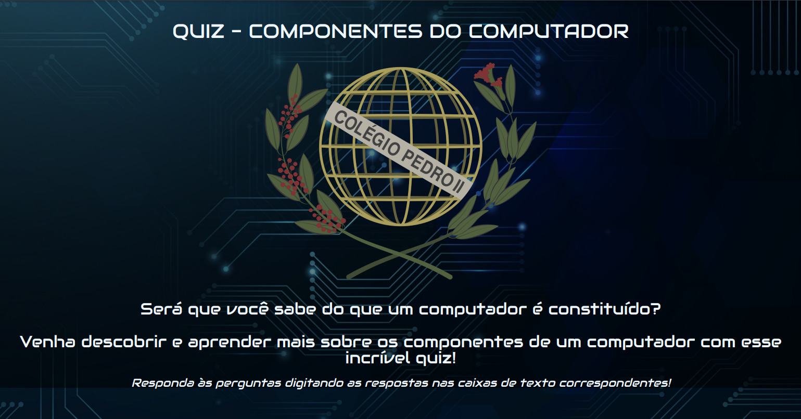

## 🖥️ Quiz Componentes do Computador 🖥️

### 📄 Resumo do Projeto 📄

Atualizei um antigo projeto, feito por mim e um amigo na época do colégio, durante o ensino médio técnico.

Essa é uma página que apresenta um quiz sobre componentes de computadores, matéria que na época estava aprendendo junto com Desenvolvimento Web.

### 🚀 Apresentação do Projeto 🚀

<a target="_blank" href="https://www.linkedin.com/posts/milton-salgado-leandro_html-css-js-activity-6960070012174766081-xinu?utm_source=linkedin_share&utm_medium=member_desktop_web">Link para a Apresentação do Projeto<a>

### 🖼️ Prévia do Projeto 🖼️

  

### 📖 Descrição do Projeto 📖

A primeira versão desse projeto foi feita durante os primórdios do meu aprendizado em Desenvolvimento Web e com isso decidi atualizá-lo com meus conhecimentos atuais em HTML5, CSS3 e JavaScript.

É um projeto totalmente responsivo e intuitivo, além de utilizar uma oganização mais atualizada.

A página contém 6 questões relacionada ao tema "Componentes de Computadores", tema estudado no técnico que fiz.

Ao responder as perguntas, uma pontuação é calculada, e no final é apresentada uma mensagem de acordo com a pontuação do usuário.

Além disso, a página também possui as funcionalidades de apagar as repostas e de limpar o resultado.

### 🛠️ Tecnologias aprendidas e utilizadas 🛠️

  
  &nbsp;
  
  &nbsp;
  

Agradeço a sua atenção e leitura deste documento!

Atenciosamente,

Milton Salgado ⚡
